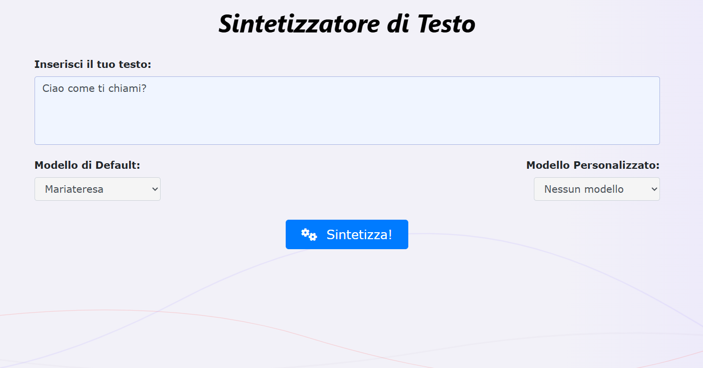

# Tacotron 2 Phoné

A comprehensive speech synthesis and voice cloning system, accessible via a web platform,  enabling not only the generation of speech from written text, but also the creation of customised voices through training using audio and transcriptions provided by users.

This implementation was developed within the Phoné Project and is based on the PyTorch implementation of Tacotron 2 provided by Gérard Bailly (CNRS, Grenoble). New contributions include (but are not limited to) the packaging of the TTS module into a containerized web-service based on FastAPI and the setup of Kubernetes deployment.

The [Phoné](https://phonegroup.github.io/) consortium, formed by the University of Naples Federico II, the CNR-ISTI in Pisa and the Free University of Bozen-Bolzano, takes its name from the Greek word 'φωνή', meaning 'linguistic sound' or 'voice'. It was established as a voluntary initiative with the following objectives: 
 - Collection of speech datasets (transcribed and non-transcribed) for training and evaluating Italian speech recognition and synthesis models;
- Definition of relevant use cases for model evaluation;
- System benchmarking using traditional and new metrics;
- Providing an independent evaluation of currently available automatic speech recognition and synthesis models in sensitive contexts such as industry, academia and government;
- Providing scientific and technological support for the third-party development of system architectures and training processes for speech recognition and synthesis;

## Thanks to

- Gerard Bailly for the Original implementation
- Vincenzo Meloni and Antonio Origlia for the dockerized service
- Vincenzo Norman Vitale for the Kubernetes deployment

# Tacotron2 - Instructions
PyTorch implementation of Tacotron 2 with several (optional) extensions:
1. Multiple decoders
2. Mixed text/phones input
3. Phonetic predictor
4. Speaker & style embeddings
5. Pre-processed target files with direct access (avoid spliting audiobooks in thousands of utterances)
6. Reference encoder
7. Freezing layers
8. Yaml configuration file. Examples could be found at: 
[https://zenodo.org/records/14893481](https://zenodo.org/records/14893481/files/tc2_italian.yaml?download=1) for Italian and [https://zenodo.org/records/7560290](https://zenodo.org/api/records/13903548/draft/files/tc2.yaml) for French
  
### Pre-processing target files
1. Frames (Mel-spectrograms, action units...) should be stored and will be generated in the following format:
  - Header with 4 int32 values: (nb-of-frames, nb-parameters; numerator of sampling frequency; denominator of sampling frequency); Note that waveglow samples spectrograms of 22050 Hz audio signals at 22050/256=86.1328125 Hz
  - Followed by nb-of-frames frames of nb-parameters float32 values
  - Naming recommendations: \<author>_\<book>_\<reader>_\<style>_<volume>_<chapter>.<parameter_name>
  - Note that \<reader>, \<style> and <parameter_name> are used in the Yaml configuration file to automatically select the appropriate items in the lists of keys 'speakers', 'styles' and 'ext_data'
2. A .csv file describing utterances. Each line contains fields separated by "|"
  - They should contain at least 4 fields: \<target_file>|\<start ms>|\<end ms>|\<text or input phones separated by spaces in {}
  - An additional field may specify aligned output phones separated by spaces
  - The key 'lgs_sil_add' in the Yaml configuration file specifies how many seconds of ambient silence (typically 0.1s) are added before \<start ms> and \<end ms>. Input text entries should "explain" these silences: we recommend to begin and end utterances produced in isolation with the end-of-chapter symbol "§", otherwise to start the current utterance with the final punctuation of the previous utterance.
  - Examples could be found at: 
[https://zenodo.org/records/7560290](https://zenodo.org/records/7560290/files/AD_train.csv?download=1) for French and 
[https://zenodo.org/records/14893481](https://zenodo.org/records/14893481/files/IT.csv?download=1) for Italian

3. Language-specific lists of text characters, input phones & output phones are specified in def_symbols.py respectively by _specific_characters, valid_symbols & valid_alignments
  - Language is selected in the Yaml configuration file via the key 'language'

### Training
1. python3 do_train.py --output_directory \<...> -c tacotron2_* --config tc2.yaml --hparams "{factor_pho: 1.00, nb_epochs: 10, learning_rate: 0.0002, batch_size: 40, nm_csv_train: '\<...>.csv', lgs_max: 10}"
2. Pre-trained models can be found at [https://zenodo.org/records/14893481](https://zenodo.org/records/14893481/files/tacotron2_IT?download=1) for Italian and [https://zenodo.org/records/7560290](https://zenodo.org/records/13903548/files/tacotron2_ALL?download=1) for French

## Batch inference/synthesis
1. python3 do_syn.py --output_directory <...> --vocoder=waveglow_NEB.pt --tacotron tacotron2_FR -e '' --config tc2.yaml --hparams "{nm_csv_test: '<...>.csv'}"
  - The list of supported neural vocoders are listed in the key 'vocoder' in the Yaml configuration file: for now, 'waveglow' and 'hifigan' are supported

## On-line Inference/synthesis
1. python3 do_tts.py --silent --no_auto_numbering --play_wav --speaker <spk>  %% On-line TTS with config tc2.yaml, play, speaker <spk> and WAVEGLOW vocoder by default
Your input>> ...
  - to use HIFIGAN: -v hifigan/generator_universal.pth.tar

## Related repos
[WaveGlow](https://github.com/NVIDIA/WaveGlow) Faster than real time Flow-based Generative Network for Speech Synthesis

[HiFi_GAN](https://github.com/jik876/hifi-gan) GAN-based model capable of generating high fidelity speech efficiently

# Tacotron2 As A service
This section describes how to build, run, and deploy the text-to-speech service, containerized via Docker and exposed via FastAPI.
## Docker Container
### Prerequisites
Since the application uses GPU acceleration, ensure the host machine has the following installed:
 - Docker Engine
 - NVIDIA Container Toolkit: required to expose GPUs to the container.
### Build the Image

To build the Docker image locally, run the following command in the docker folder:

    docker build -t phone-tts-app .

### Running the Container

Start the container mapping port 8080 of the container to port 8080 of the host and enabling access to all available GPUs:

    docker run --gpus all -p 8080:8080 phone-tts-app

Once started, the service will be accessible locally. You can view the interactive API documentation (Swagger UI) at:

http://localhost:8080/docs

While you will find the user interface at http://localhost:8080/

## Kubernetes Deployment
The project is set up for deployment on Kubernetes clusters equipped with GPU nodes.

### Image Preparation

Before deploying, you must tag the image and push it to a Container Registry accessible by the cluster (e.g., Docker Hub, GHCR, AWS ECR):

    # Tag and push example
    docker tag phone-tts-app <your-registry>/phone-tts-app:latest
    docker push <your-registry>/

**Note**: Make sure to update the image reference (image: <your-registry>/phone-tts-app:latest) in the Deployment configuration file (deployment.yaml).

### GPU Resource Configuration

The deployment manifest must explicitly request GPU resources. Ensure the resources section of the container spec contains the limit for nvidia.com/gpu:

    resources:
    limits:
      [nvidia.com/gpu](https://nvidia.com/gpu): 1

### Deploy to the Cluster

Apply the configuration manifests (Deployment and Service) using kubectl. Assuming the files are located in the kubernetes/ folder:

    kubectl apply -f kubernetes/

This will apply all the service yaml present in the folder.

### Accessing the Service

To test the service without configuring an Ingress controller, you can use port-forwarding:

    kubectl port-forward svc/phone-tts-service 8080:80

The service will now be reachable at http://localhost:8080

**Note**: Depending on your configuration you may need to change localhost with another address.